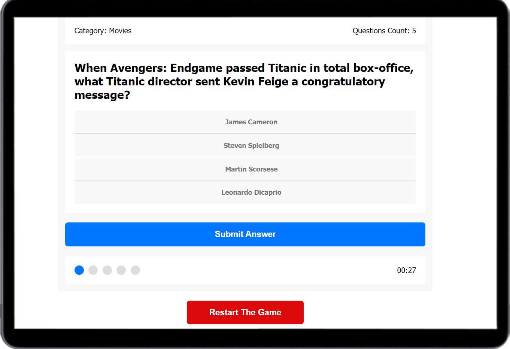

<h1 align="center">
Trivia-Game
</h1>

<br /> 

### Showcase



### Built with

- HTML
- Css
- JavaScript


### Run Locally

To run **Trivia-Game** locally, run this command on your git bash:

Linux and macOS:

```bash
sudo git clone https://github.com/momo-dev1/Trivia-game
```

Windows:

```bash
git clone https://github.com/momo-dev1/Trivia-game
```
